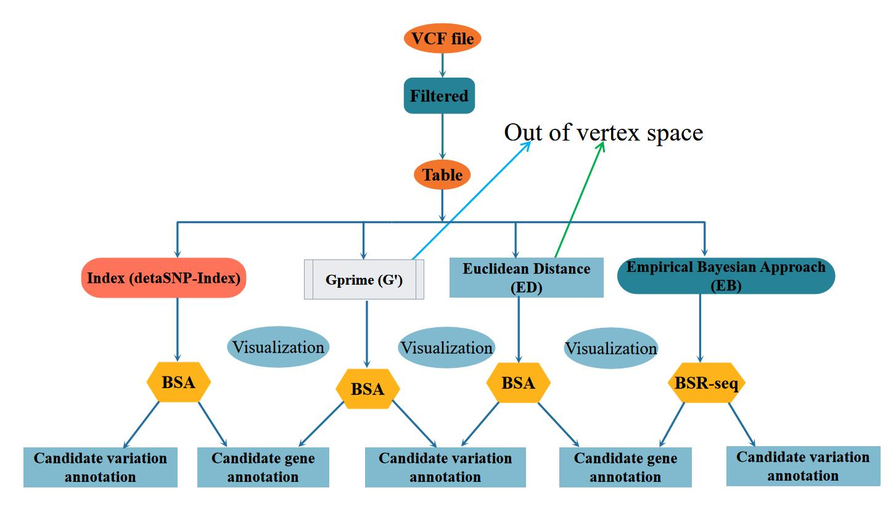

<!-- README.md is generated from README.Rmd. Please edit that file -->
## BSA workflow



>SO this pipeline that aiming to use [MutMap](https://www.nature.com/articles/nbt.2095) and [QTL-seq](https://onlinelibrary.wiley.com/doi/full/10.1111/tpj.12105) method which rapidly mapping of quantitative trait loci in animal or plant species by whole genome resequencing of DNA from two bulked populations (F1, F2, DH or RIL). For more details, Please see the mutmap and QTL-seq paper. 

QTL-seq method:
> Takagi, H., Abe, A., Yoshida, K., Kosugi, S., Natsume, S., Mitsuoka, C., Uemura, A., Utsushi, H., Tamiru, M., Takuno, S., Innan, H., Cano, L. M., Kamoun, S. and Terauchi, R. (2013), QTL-seq: rapid mapping of quantitative trait loci in rice by whole genome resequencing of DNA from two bulked populations. *Plant J*, 74: 174–183.[doi:10.1111/tpj.12105](https://onlinelibrary.wiley.com/doi/full/10.1111/tpj.12105)

G prime method:

> Magwene PM, Willis JH, Kelly JK (2011) The Statistics of Bulk Segregant Analysis Using Next Generation Sequencing. *PLOS Computational Biology* 7(11): e1002255.[doi.org/10.1371/journal.pcbi.1002255](http://journals.plos.org/ploscompbiol/article?id=10.1371/journal.pcbi.1002255)

Euclidean distance calculation (ED->MAPPR)
>Hill J T , Demarest B L , Bisgrove B W , et al. MMAPPR: Mutation Mapping Analysis Pipeline for Pooled RNA-seq. [Genome Research](https://genome.cshlp.org/content/23/4/687.long), 2013, 23(4):687-697.
Bulked Segregant RNA-Seq (BSR-Seq)
> Liu S, Yeh CT, Tang HM, Nettleton D, Schnable PS (2012) Gene Mapping via Bulked Segregant RNA-Seq (BSR-Seq). PLOS ONE 7(5): e36406. https://doi.org/10.1371/journal.pone.0036406


## Installation 
Polymap pipeline depends on some R packages, before using it make sure you alread install these packages :

<!-- install packages -->


``` r
#install QTLseqr
# install devtools first to download packages from github
install.packages("devtools")
# use devtools to install QTLseqr
devtools::install_github("bmansfeld/QTLseqr")
# and basics R packages
library(magrittr)
library(dplyr)
library(tidyr)
library(parallel)
library(grid)
library(ggplot2)
library(gridExtra)
```
### USAGE

```linux
$perl bsa.pipeline.pl
Contact:        czheluo@gmail.com
Script:                 bsa.pipeline.pl
Description:
        eg:
        perl  bsa.pipeline.pl
Usage:
  Options:
        -vcf   pop.final.vcf
        -ann pop.summary or anno.summary
        -ref ref.fa file or if you want to use the GATK to generate TABLE (default is NO)
        -pid  parental name A,B
        -bid  bulk name C,D
        -out out dir
        -bs    bulk size default was 30
        -ws window size default was 1M
        -pta pemutation test confidence interval
        -ptb pemutation test confidence interval
        -tgl  total genetic length (default was 2000)
        -bs Set N to be the number of individuals in the mutant pool
        -step which step you want
        -stop control the step
        -h      Help
```
1.methods

MBSA provides several different statistics for analysis as follows:
* ED^4 = EuclideanDist (default) -> Euclidean Distance
* SNPindex -> Delta SNPindex :
The analysis is based on calculating
the allele frequency differences, or ∆(SNP-index), from the allele depths at each SNP. To determine regions
of the genome that significantly differ from the expected ∆(SNP-index) of 0.

* G’ analysis :
An alternate approach to determine statistical significance of QTL from NGS-BSA was proposed by Magwene et al. (2011) – calculating a modified G statistic for each SNP based on the observed and expected allele
depths and smoothing this value using a tricube smoothing kernel. Using the smoothed G statistic, or G’, Magwene et al.
* Bulked Segregant RNA-Seq (BSR-Seq) : 
An empirical Bayesian approach was used to estimate, for each SNP, the conditional probability of no recombination between the SNP marker and the causal gene in the mutant pool, given the SNP allele-specific counts.

2.Inputs

The main input file is the VCF file which contains genomic variants for  two bulks and parental bulks, and your species genome annotation (blast to GO, KEGG, interproscan, NT/NR etc.). For the genomic variant calling, I'd love to recommendate using GATK.

